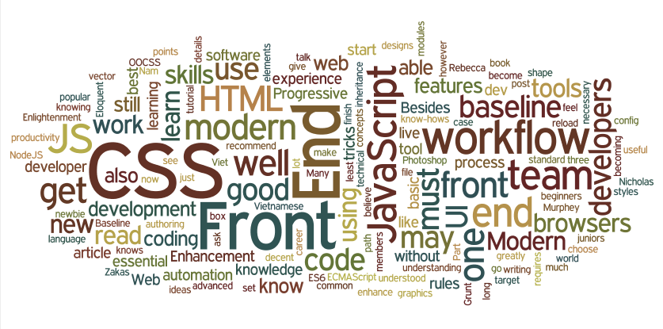

Hệ thống kiến thức tối thiểu (baseline) là gì:

Tại sao phải có đường cơ sở cho Front End:

Từ kinh nghiệm làm việc trong nhiều nhóm phát triển phần mềm lớn nhỏ khác nhau, tôi nhận ra rằng việc thiết lập hệ thống kiến thức cơ sở (baseline) cũng quan trọng không kém những quy ước lập trình trong nhóm.

Rõ ràng việc phát triển kiến thức và kỹ năng của từng thành viên lên để đạt chuẩn không chỉ cải thiện sự hợp tác nhóm mà còn cải thiện hiệu suất làm việc của họ.

Khi xây dựng nhóm phát triển front end ỏ Nâu Studio, tôi đã nghiên cứu thật kỹ về những kỹ năng và kiến thức chuyên môn tối cần thiết mà sẽ được đưa vào hệ thống kiến thức cơ sở của nhóm và là tâm điểm của việc huấn luyện căn bản.

Lấy cảm hứng từ bài viết [Đường cơ sở về kiến thức cho các lập trình viên Front End](http://rmurphey.com/blog/2012/04/12/a-baseline-for-front-end-developers/) của Rebecca Murphey, tôi sẽ ghi lại Đường cơ sở về kiến thức cho các lập trình viên Front End hiện đại với hệ thống phù hợp hơn cho người mới bắt đầu cũng như cập nhật những xu hướng mới nhất của năm 2015.

Để bắt đầu, tôi sẽ bàn về 3 trụ cột của Web Front End:

## HTML

Thực tế cho thấy có rất nhiều lập trình viên xem nhẹ HTML. Qua quan sát của tôi, nhiều lập trình viên dùng tag HTML rất tuỳ tiện, thêm các tag bao (wrapper) một cách vô tội vạ và kết quả là việc xử lý giao diện tuỳ ứng (responsive) cũng như canh lề rất vất vả và chắp vá.

Khi làm càng nhiều, bạn sẽ sớm nhận ra rằng HTML được viết gọn gàng và súc tích sẽ giúp ích rất nhiều cho việc xủ lý CSS và cải thiện tốc độ website trên trình duyệt (đặt biệt là trên thiết bị di động). Để làm được như vậy đòi hỏi một kỹ năng tuyệt vời, và tôi dám nói rằng viết HTML là cả một nghệ thuật.

Vì vậy, để trở thành một lập trình viên HTML thành công, bạn phải có khả năng kết hợp các phần tử (element) HTML để đạt yêu cầu cả về ngữ nghĩa và tính tối ưu. Điều này có nghĩa bạn phải nắm vững các quy luật layout mặc định và ý nghĩa sử dụng của tất cả các thẻ HTML.

Ngoài việc tiến bộ dần thông qua kinh nghiệm thực tế, bạn có thể tăng tốc kỹ năng HTML của mình nếu được đào tạo bài bản từ những cái căn bản.

Các tài liệu hỗ trợ:

- HTML5 Doctor: [http://html5doctor.com/](http://html5doctor.com/) 
- HTML basic tutorial: [https://docs.webplatform.org/wiki/html/tutorials](https://docs.webplatform.org/wiki/html/tutorials) 

## CSS

Rất nhiều người mới bắt đầu với Web, đặc biệt là sinh viên CNTT ở Việt Nam, được học rất sơ sài về CSS trên lớp và các sách giáo trình liên quan đều lỗi thời. Đa số các bạn sẽ học CSS bằng phép sai-và-thử và đó là một quá trình tiến bộ cực kỳ kém hiệu quả.

Điều này không tồn tại trong team của Nâu. Những khái niệm căn bản của CSS như thứ tự kiểu thác nước (cascading), luật về độ ưu tiên (specificity), bộ chọn lọc (selectors), sự thừa kế, mô hình hộp (box model), và ngữ cảnh xếp chồng (stacking context) phải được các bạn hiểu rõ.

Sau những kiến thức căn bản, bạn nên bắt đầu tìm hiểu về [CSS hướng đối tượng (OOCSS)](https://github.com/stubbornella/oocss/wiki) hoặc bắt đầu thực hành những chỉ dẫn trong tài liệu [Những nguyên tắc về CSS](http://cssguidelin.es/)

Ngoài ra, một lập trình viên front end giỏi luôn thủ sẵn một số thủ thuật về CSS. Chẳng hạn, bạn phải biết tất cả các mẹo canh giữa nội theo chiều dọc khác nhau khi mà Flexbox vẫn chưa được áp dụng rộng rãi. Bạn cũng phải biết khi nào cần dùng pseudo-elements, các khối hình học bằng CSS thuần, icon từ webfont, hoặc sprite sheet… để hiện thực giao diện với hiệu suất và độ tương thích tốt nhất.

Cuối cùng, một lập trình viên front end hiện đại phải biết sử dụng một ngôn ngữ biên dịch sang CSS (preprocessor) để cải thiện khả năng bảo trì và hiệu suất làm việc với CSS.

Một khi nền tảng đã được nắm vững, bạn sẽ thấy việc học thêm hoặc ứng dụng những tính năng mới của CSS3 sẽ chẳng có chút khó khăn.

Tài liệu tham khảo:

- Hướng dẫn CSS căn bản: [https://docs.webplatform.org/wiki/css/tutorials](https://docs.webplatform.org/wiki/css/tutorials)
- OOCSS: [https://github.com/stubbornella/oocss/wiki](https://github.com/stubbornella/oocss/wiki) 
- Những nguyên tắc CSS: [http://cssguidelin.es/](http://cssguidelin.es/) 
- Các thủ thuật CSS: [http://css-tricks.com/](http://css-tricks.com/) 

## JavaScript

Nếu như cách đây vài năm trước, jQuery là yêu cầu bắt buộc để nhập môn Web Front End thì bây giờ [không còn nữa](http://youmightnotneedjquery.com/). Tuy nhiên theo tôi nó vẫn rất hữu ích cho những người mới bắt đầu thực hành JavaScript trong bối cảnh tính năng và sự tương thích giữa các trình duyệt vẫn chưa đồng nhất.

Tiếp theo sau jQuery, việc nắm vũng kiến thức về JavaScript thuần vẫn là mục tiêu tối quan trọng cho người làm Front End. Bên cạnh học từ quyển sách kinh điển [JavaScript: The Good Parts](http://www.amazon.com/exec/obidos/ASIN/0596517742/wrrrldwideweb) do Rebecca giới thiệu, ngày nay bạn có thêm những lựa chọn miễn phí nhưng không kém chất lượng như quyển Eloquent JavaScript hoặc JavaScript Enlightenment.

Từ kinh nghiệm thực tiễn, tôi tin rằng những đặc tính của ngôn ngữ JavaScript sau đây cần được nắm bất kể trình độ bạn đang ở đâu, đó là chuỗi prototype (prototype chain), sự bao đóng (closure), và từ khoá `this`. Ngoài ra những đặc tính độc đáo khác của JS mà lập trình viên cũng cần phải biết như chuyển đổi kiểu động, xây dựng đối tượng trực tiếp từ giá trị (literal), sự dịch chuyển lên trên vị trí khai báo của biến và hàm (variable and function hoisting)…

Khi đã thành thạo với JavaScript thuần, và muốn tiếp cận cách viết có cấu trúc để dễ mở rộng vả bảo trì, bạn sẽ nghiên cứu các đặc ngữ của JS (idiom), mẫu thiết kế (design pattern), cách viết module, và các framework MV* phổ biến hiện nay.

Năm 2015 là năm mà phiên bản tiếp theo của JavaScript, ECMAScript 6 (hay còn gọi là ECMASCript 2015) được thống nhất và thông qua về đặc tả để tiến hành hiện thực dần trong các phiên bản trình duyệt tiếp theo. Đi kèm đó là [xu hướng](https://www.youtube.com/watch?v=PlmsweSNhTw) sử dụng công cụ biên dịch từ ES6 sang ES5. Để không đứng ngoài xu hướng, bạn cần trang bị kiến thức về ECMAScript 6 ngay bây giờ và nên thử nghiệm quy trình viết bằng ES6 và biên dịch thành ES5 để chạy trên các trình duyệt hiện tại.

Nói về NodeJS, theo tôi nó không thuộc hệ thống kiến thức tối thiểu cho người lập trình Front End (trừ khi bạn viết cả back end bằng NodeJS). Tuy nhiên, bạn sẽ dần làm quen với nó như một hệ quả tất yếu khi bạn sử dụng những công cụ trong quy trình Front End (xem bên dưới) mà hầu hết đều được viết bằng NodeJS.

Các link tham khảo:
- [Eloquent JavaScript](http://eloquentjavascript.net/): tài liệu dành cho người mới học JavaScript rất hay, và miễn phí.
- [JavaScript Enlightenment](http://www.javascriptenlightenment.com/): Một quyển sách khác dành cho người học JS từ đầu.
- [Idiomatic JavaScript](https://github.com/rwaldron/idiomatic.js/): Đôi khi bạn đọc những đoạn code JS người khác viết mà không hiểu. Những đoạn “mật mã” đó sẽ được giải mã tại đây. ;)
- [TodoMVC](http://todomvc.com/): Website không thể bỏ qua cho những bạn cần tham khảo và so sánh kiến trúc của những framework MV* khác nhau.
- [Writing Modular JS](http://addyosmani.com/writing-modular-js/): Thông tin hữu ích về về các mẫu thiết kế module.
- [Understanding ES6](https://leanpub.com/understandinges6): Học ECMAScript 6 với Nicholas C. Zakas

## Quy Trình Front End Hiện Đại

Như tôi đã đề cập, kết quả làm việc nhóm có tốt hay không một phần phụ thuộc vào việc các thành viên có tuân thủ quy ước viết code (coding style convention) và quy trình làm việc (workflow) của nhóm. Tuy nhiên, để nhớ hết tất cả các quy tắc đó không phải là việc đơn giản. Trong đội lập trình của Nâu, chúng tôi sử dụng các công cụ kiểm lỗi được tích hợp trong quy trình từ lúc soạn thảo cho đến biên dịch, giúp duy trì quy ước và hình thành thói quen cho các thành viên.

Không cần phải bàn cãi, trình duyệt là công cụ không thể thiếu của người làm Front End. Có hai kỹ năng mà tôi muốn nhấn mạnh ở đây đó là khả năng sử dụng công cụ cho người lập trình (developer tools) có sẵn trong trình duyệt và khả năng sử dụng phần mềm tự động nạp lại trang web (live reload). Tất cả các trình duyệt hiện đại đều có dev-tools đi kèm, tuy nhiên theo tôi, dev-tools trên trình duyệt Chrome là tốt nhất cho cho đến bây giờ. Về phần mềm tự nạp trang, bạn có thể thử dùng [Browsersync](http://www.browsersync.io/).

Bên cạnh trình duyệt, trình soạn thảo code đóng vai trò quan trọng không kém. Bất kể bạn chọn phần mềm gì, hãy bảo đảm rằng nó có khả năng tự hoàn tất code cũng như là khả năng kiểm lỗi tức thì cho ngôn ngữ lập trình bạn viết. Trình soạn thảo cho Front End hiện đại cũng rất cần khả năng sửa văn bản trên nhiều con trỏ và mở file nhanh bằng tìm kiếm. Nếu bạn hỏi tôi, tôi sẽ đề thử dùng [Sublime Text](http://www.sublimetext.com/) hoặc [Atom](https://atom.io/). Ngoài ra, đừng bỏ qua [Emmet](http://emmet.io/), một công cụ bổ sung cho các trình soạn thảo "giúp cải thiện hiệu suất làm việc với HTML và CSS một cách đáng kể".

Quy trình Front End hiện đại sẽ rất thiếu sót nếu không nhắc đến những công cụ tự động hoá chạy bằng dòng lệnh (command line) như Grunt, Gulp hoặc những công cụ tương tự có giao diện (GUI) như Codekit, LiveReload. Việc xử lý từng bước và tối ưu hoá sản phẩm Front End đã trở nên rất phức tạp để có thể làm bằng tay. Khả năng vận dụng các công cụ tự động hoá đã trở thành yêu cầu cơ bản của lập trình viên Front End.

Các kỹ năng và kiến thức hiển nhiên khác mà bạn cần phải có: sử dụng phần mềm quản lý phiên bản, quy trình phát triển phần mềm, mô hình phát triển phần mềm agile, công cụ hỗ trợ giao tiếp (email, nhắn tin, gọi video…), và hiểu biết tối thiểu về hệ điều hành mà bạn dùng để làm việc.d

- [Nau Front End Dotfiles](https://github.com/naustudio/dotfiles): Một số cài đặt và công cụ cho quy trình của Nâu.
- [Tự động hoá với Grunt (video)](https://youtu.be/38D6SW26mn0): Tôi sẽ hướng dẫn các bạn sử dụng một trong những công cụ tự động hoá Front End phổ biến nhất .
- [Khởi tạo dự án Front End với các công cụ kiểm tra lỗi tự động (video)](https://youtu.be/sBNkiuDkILA): Đây là một phần của quy trình khởi tạo dự án mới mà chúng tôi đang áp dụng.
- [Quy trình phát triển Front End hiện đại từ đầu đến cuối](http://blog.chartbeat.com/2014/01/30/modern-front-end-workflow-start-finish/).
- [Quy trình phát triển dự án JavaScript (video)](https://youtu.be/f7AU2Ozu8eo) bởi Paul Irish. Mặc dù đã được trình bày cách đây 2 năm, nhưng những công cụ được đề cập vẫn được áp dụng trong thời điểm hiện tại.

## Sự Cải Tiến Tăng Dần (Progressive Enhancement)

Hiểu biết về Cải Tiến Tăng Dần đã trở thành một yêu cầu bắt buộc đối với các lập trình viên Front End hiện đại. Đã qua rồi cái thời mà lập trình viên phải cố gắng hiện thực trang web cho giống y đúc trên mọi trình duyệt hoặc loại bỏ hoàn toàn những trình duyệt mà đặc tả không yêu cầu hỗ trợ. Phương pháp được khuyến khích như là chuẩn mực hiện nay đó là Cải Tiến Tăng Dần (Progressive Enhancement), trong đó lập trình viên Front End sẽ hiện thực website với trải nghiệm tốt nhất có thể tuỳ theo khả năng của từng loại trình duyệt khác nhau. Điều này yêu cầu bạn phải có hiểu biết về các phiên bản khác nhau của JS / CSS / HTML mà các trình duyệt hỗ trợ; biết sử dụng caniuse.com, modernizr, HTML5BoilerPlate; cũng như biết khi nào cần áp dụng polyfill hoặc bỏ qua một hiệu ứng (nhưng nội dung vẫn đầy đủ) trên một trình duyệt nào đó.

Tham khảo thêm:
- [Progressive Enhancement 2.0](https://youtu.be/hdTxeR90_1E) trình bày bởi Nicholas Zakas
- [Progressive Enhancement: What Is It and How to Use It](http://www.smashingmagazine.com/2009/04/22/progressive-enhancement-what-it-is-and-how-to-use-it/)

## Kỹ Năng Về Giao Diện

Bạn cần có chút hiểu biết về hiệu ứng kiểu chữ (typography), các khái niệm giao diện (UI) và chuyển động (animation) và biết những thuật ngữ chuyên sâu để có thể trao đổi một cách dễ dàng với các bạn thiết kế. Ví dụ: nút hamburger, hero banner, the fold…

Bên cạnh đó, bạn cũng cần có kỹ năng sử dụng Photoshop ở mức cơ bản để có thể trích xuất được những hình ảnh cần thiết cho việc hiện thực cũng như tham khảo các giá trị cho CSS (độ trong suốt, chuyển tiếp màu, màu sắc…). Những thao tác bằng tay này có thể sẽ được thay thế hoàn toàn bằng những công cụ hiện đại (Photoshop CC 2014, Sketch…) tuy nhiên kỹ năng về phần mềm đồ hoạ vẫn hữu ích cho bạn khi thỉnh thoảng bạn sẽ cần tự mình chỉnh sửa lên file mà không cần sự hỗ trợ của người thiết kế.

Bước vào năm 2015, một kỹ năng nữa mà bạn cũng cần biết, đó là sử dụng công cụ xử lý ảnh vector (Illustrator, Inkscape…) để hiệu chỉnh và trích xuất các icon và thành phần giao diện bằng vector cho thiết kế phẳng (flat design) đang là xu hướng của cả thế giới.

## Kết Luận
